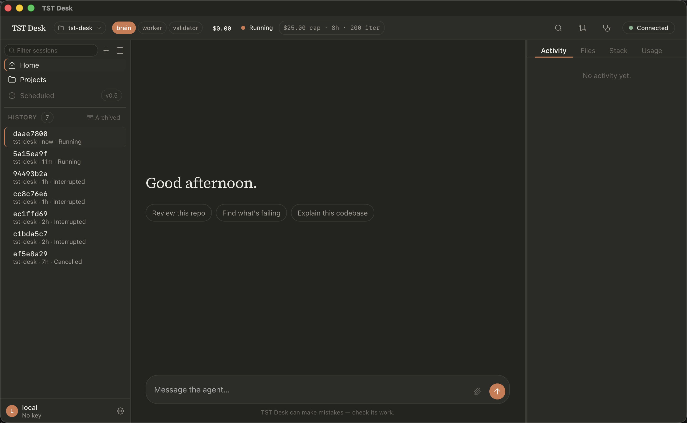

# TST Desk

**An open-source, bring-your-own-model desktop agent workspace.**

TST Desk is a desktop application that gives you an AI coworker in a window: you point it at a
folder, type what you want, and watch it work — reading files, running commands, and asking
before it does anything consequential. It looks and feels like Claude Desktop with a Cowork-style
workspace, but it runs on models *you* choose through any OpenAI-compatible endpoint, billed to
*your* API key, with a live cost meter in the title bar. There is no server, no hosted backend,
no account, and no subscription — and pointed at a local model server it needs no API key and no
network at all.



---

## Install

v0.1 has not been tagged yet, so the release page below is empty until the first `v*` tag is
pushed. When it lands, each platform gets these artifacts, built by
[`.github/workflows/package.yml`](.github/workflows/package.yml):

| Platform | Artifact |
|---|---|
| macOS (Apple silicon) | `.dmg`, `aarch64-apple-darwin` |
| macOS (Intel) | `.dmg`, `x86_64-apple-darwin` |
| Linux | `.AppImage` and `.deb`, `x86_64` |
| Windows | `.msi`, `x86_64` |

1. Download the artifact for your platform from
   [the releases page](https://github.com/ThatSimpleTech/TST-Desk/releases).
2. Verify it against the published `SHA256SUMS.txt`.
3. Install it:
   - **macOS** — open the `.dmg`, drag **TST Desk** to Applications.
   - **Linux** — `chmod +x` the AppImage and run it, or `sudo dpkg -i` the `.deb`.
   - **Windows** — run the `.msi`.
4. First launch will warn you, because v0.1 builds are unsigned. See
   [Installing an unsigned build](#installing-an-unsigned-build) below for the per-platform
   click-through.

Until there is a release, the app runs from source — see [Development](#development).

## Quickstart

Five minutes, launch to first result. The first-run wizard is: welcome → API key → preset →
workspace → done.

1. **Download it, install it, open it.** [Install](#install) above has the per-platform steps;
   clearing the unsigned-build warning on first launch is a one-time click. (Until the first
   release is tagged there is nothing to download — run it from source instead.)
2. **Paste an API key.** The wizard links to where to get one and validates it with a single
   cheap live call. The key goes into your OS keychain, not a file.
   *Or skip this entirely:* pick the `local` preset instead. It ships pointed at Ollama's
   default loopback port, and for a loopback endpoint no key is asked for and none is sent.
   (Any other OpenAI-compatible server means editing that tier's `base_url` in `config.yaml`
   by hand — there is no UI for it yet.)
3. **Pick a preset.** `tst-default`, `budget`, or `local`. You can change presets from settings,
   and pin which tier handles the turn from the title bar mid-session. Changing the *model*
   behind a tier is also a settings change, but it applies to new sessions — a running session
   keeps the model it opened with.
4. **Pick a workspace.** A native folder picker. The folder is the unit of work — TST Desk
   scaffolds a `.tst/` directory in it with a commented default config, resolves any `AGENTS.md`
   or `CLAUDE.md` it finds, and shows you the resolved instruction stack.
5. **Type a request.** You get streamed output in the chat pane, an activity timeline on the
   right, and an approval card whenever it wants to do something that needs your say-so. Approve
   it, and you have your first result.

Nothing in those five steps creates an account anywhere.

## What it costs

You are billed by your provider for the tokens you use. Nothing is billed by us, because there
is nobody to bill you — see [The promises](#the-promises).

The shipped stack routes three tiers: a **brain** for planning turns, a **worker** for
token-heavy edits, and a **validator** for review. Cheap tiers do the volume; the expensive tier
only plans. Three presets ship, and the prices below are the ones in
[`core/tstd/config.yaml`](core/tstd/config.yaml), in dollars per million tokens:

| Preset | Tier | Input | Output | Cache read |
|---|---|---|---|---|
| `tst-default` | `brain` | $2.80 | $14.00 | $0.30 |
| `tst-default` | `worker` | $0.07 | $0.17 | $0.07 |
| `tst-default` | `validator` | $0.44 | $0.87 | $0.44 |
| `budget` | `brain` | $0.15 | $0.60 | $0.015 |
| `budget` | `worker` | $0.07 | $0.17 | $0.07 |
| `budget` | `validator` | $0.44 | $0.87 | $0.44 |
| `local` | `brain` | $0.00 | $0.00 | $0.00 |
| `local` | `worker` | $0.00 | $0.00 | $0.00 |
| `local` | `validator` | $0.00 | $0.00 | $0.00 |

Model slugs are deliberately not restated here. The landscape moves weekly, so
`core/tstd/config.yaml` is the one place they live — read it there, and change them there
without waiting for a release.

**A worked turn.** Token counts below are illustrative, but the prices and the arithmetic are
the shipped ones — this is [`compute_call_details`](core/tstd/cost.py) run on
`tst-default`'s `brain`. A turn sending 20,000 prompt tokens, of which the provider reports
15,000 served from cache, and generating 1,500 tokens:

```
  5,000 uncached prompt  × $2.80/M  =  $0.0140
 15,000 cached prompt    × $0.30/M  =  $0.0045
  1,500 completion       × $14.00/M =  $0.0210
                                       -------
                                       $0.0395
```

Cache-read tokens are always priced at the cache rate, never the input rate — and only when the
provider actually reports them. A provider that says nothing about cache reuse is billed as if
there was none, so the meter never quietly understates what you owe.

**Per session.** The spec estimates the three-tier stack at roughly **$0.36 per working
session** (`docs/tst-desk-spec.md` §1). Treat that as an estimate, not a measurement: it is a
design-time figure, and this build has not published one of its own. What the build does give
you is the real one — a live meter in the title bar showing spend per turn, per session and per
day, broken down by tier, plus a spend cap that pauses the session when it is hit.

**Per session, on `local`.** Zero. Every price in the `local` preset is `0.0`, so the meter
reads `$0.00` and means it.

## The promises

These are not marketing lines. They are architectural constraints, written down as prime
directives in [`AGENTS.md`](AGENTS.md) §2 and enforced in code.

- **No account.** There is nothing to sign up for. The only credential in the system is your own
  provider API key, and on the `local` preset there is not even that:
  [`config.py`](core/tstd/config.py)'s `requires_api_key()` returns false when every tier points
  at loopback, and the provider client is then built with `api_key=None` and sends no
  `Authorization` header at all.
- **No server.** The daemon binds `127.0.0.1` and nothing else.
  [`ws.py`](core/tstd/ws.py)'s `validate_interface()` refuses every other interface, and the
  server's `start()` deliberately takes no `host` parameter, so the literal cannot be
  configured away. `core/tests/test_security_suite.py` asserts both.
- **No subscription.** You pay your model provider per token and nobody else. There is no
  billing code in this repository because there is nothing to bill.
- **No telemetry.** No analytics, no phone-home, no crash reporting. The only outbound HTTP the
  daemon makes is to the `base_url` you configured: there is exactly one chat client
  ([`provider.py`](core/tstd/provider.py)), and its endpoint comes from config, never from a
  literal in the source. Model discovery refuses any non-loopback endpoint *before* it sends
  ([`discovery.py`](core/tstd/discovery.py)).
  [`core/tests/test_outbound_hosts.py`](core/tests/test_outbound_hosts.py) enumerates every
  destination the process can open — source literals, the live sending paths, and import-time
  sockets — and fails if a host appears that configuration did not name.
- **Your key never touches disk.** It lives in the OS keychain — Keychain, Secret Service, or
  Credential Manager ([`keychain.py`](core/tstd/keychain.py)). Every log and audit path runs
  through one shared redactor ([`logging.py`](core/tstd/logging.py)), and
  `core/tests/test_credential_hygiene.py` drives a real daemon with a canary key and asserts it
  appears in no wire payload, no log record, and no byte of any file under the data directory —
  and in no audit row, where the credential flow produced a database to scan.
- **The agent cannot rewrite its own rules.** `AGENTS.md`, `CLAUDE.md` and `.tst/rules/**` are
  refused by the filesystem tool itself ([`tools/boundary.py`](core/tstd/tools/boundary.py)),
  ahead of the workspace check and ahead of any approval — so no `writable_paths` grant can open
  them.

## How it compares

Against Claude Desktop, Cowork, and hosted agent workspaces generally. These are good products
built by large teams, and this table is only useful if it says so.

| | TST Desk | Claude Desktop / Cowork / hosted workspaces |
|---|---|---|
| **Setup** | Get an API key, paste it, pick a folder | Sign in and go. Genuinely less work |
| **Polish** | v0.1, in development, unsigned binaries | Years of QA, signed, notarized, auto-updating |
| **Support** | GitHub issues and whoever shows up | A company, a support channel, an SLA |
| **Infrastructure** | Yours to run; local models need local hardware | Managed. Nothing to provision, nothing to keep warm |
| **Model quality out of the box** | Whatever you pick and pay for | Frontier models in a harness tuned for them |
| **Mobile / sync** | None | Usually both |
| **Pricing** | Per token, metered live — no floor, and a spend cap that pauses you | Flat subscription — predictable, and cheaper if you are a heavy user |
| **Model choice** | Any OpenAI-compatible endpoint; three tiers you pick, with routing pinnable mid-session | The vendor's models |
| **Whose key** | Yours. You see the bill and the meter | The vendor's, folded into the subscription |
| **Offline** | Runs against a local model server — no key asked for, none sent | No |
| **Audit trail** | Append-only SQLite on your disk — INSERT-only by construction; model calls export to CSV or JSONL | The vendor's logs, on the vendor's terms |
| **Steering** | `AGENTS.md` hierarchy you own, with an inspector showing the resolved stack and its token cost | Project instructions, less visible |
| **Source** | Apache-2.0. Fork it, audit it, change the model table | Closed |
| **Account** | None | Required |

Where they genuinely win: nothing to configure, nothing to keep running, and a product that has
been shipping long enough to have had its rough edges filed off. If you want an agent workspace
that just works today, buy one of theirs. TST Desk is for people who want to own the key, the
model choice, the audit trail, and the code.

## Status

v0.1 — **in development, not yet released.** No tag has been pushed, so there is nothing to
download yet; packaging runs in CI but has not yet produced a green artifact set
(`TD-1302`, `TD-1303`). Running it today means running it from source.

What works: streaming chat, the three-tier router, the steering assembler and instruction
inspector, filesystem and shell tools behind a decision classifier and approval cards, path
boundaries and spend/time/iteration caps, the live cost meter and usage export, the append-only
audit log, the session rail, settings, diagnostics, and keyless local-model support.

What is not built yet, and is not claimed anywhere above: computer-use, detached "coworker"
sessions that outlive the window, agent memory, the autonomous runner, and remote attach. Those
are v0.2 and later — see [`docs/tst-desk-spec.md`](docs/tst-desk-spec.md) §9 for the phasing.

See [`docs/tst-desk-backlog.md`](docs/tst-desk-backlog.md) for the current milestone and
[`docs/tst-desk-spec.md`](docs/tst-desk-spec.md) for the full architecture spec. How the pieces
fit together — the daemon/shell split, the wire protocol, the extension points, and how to add a
tool — is in [`docs/architecture.md`](docs/architecture.md). Every configuration key is
documented in [`docs/configuration.md`](docs/configuration.md), and writing `AGENTS.md` and
path-scoped rules is covered in [`docs/steering.md`](docs/steering.md). Where Windows behaves
differently — path forms, 8.3 short names, file permissions, killing a command — is in
[`docs/windows.md`](docs/windows.md).

## Development

### Prerequisites

- Python 3.11+
- [uv](https://docs.astral.sh/uv/) (Python package manager)
- Rust 1.77+ (for the Tauri host)
- Node.js 24+ (for the frontend)

### Setup

```bash
# Python core
cd core
uv sync

# Frontend
cd ../ui
npm install
```

### Running it

```bash
# From ui/ — builds the Rust host, starts the daemon as a sidecar, opens the window
npm run tauri:dev
```

### Tests

```bash
cd core && uv run pytest        # Python core
cd ui && npm test               # frontend
```

### Pre-commit hooks

This repository uses [pre-commit](https://pre-commit.com) to run linting, formatting, and
secret detection on every commit.

```bash
# Install hooks (one-time, from the core/ directory)
cd core
uv run pre-commit install
```

The hooks will then run automatically on `git commit`:
- **ruff check** — lint Python files
- **ruff format** — format Python files
- **Secret detection** — blocks commits containing API keys, tokens, passwords, and other
  credential-like patterns

To bypass the hooks (e.g. for a false positive):
```bash
git commit --no-verify
```

## Installing an unsigned build

v0.1 builds are not code-signed or notarized (see `DECISIONS.md`, 2026-08-14).
Each OS will warn on first launch; that is expected, not a defect.

- **macOS** — Gatekeeper blocks the unsigned app. Right-click the app and
  choose **Open**, then confirm in the dialog (once per install). If the file
  was download-quarantined and the Open trick does not appear:
  `xattr -d com.apple.quarantine "/Applications/TST Desk.app"`.
- **Windows** — SmartScreen shows "Windows protected your PC". Click
  **More info → Run anyway**.
- **Linux** — no signing warning. For the AppImage, `chmod +x` and run; the
  `.deb` installs with `sudo dpkg -i`.

## License

Apache-2.0. See [`LICENSE`](LICENSE) and [`NOTICE`](NOTICE).
